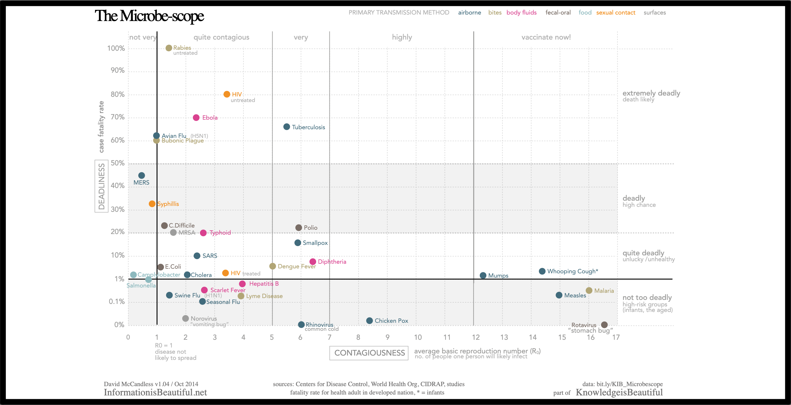

# Herd Immunity Simulation
Basic simulation of the of herd immunity by modeling how a virus moves through a population where some (but not all) of a population is vaccinated against this virus.
### Information
Various Virus Data, Mortality Rate and Reproductive Rate derived from the [Gurdian](https://tinyurl.com/gllzupc) and [Microbe Scope](https://tinyurl.com/y67ta2mp)

<<<<<<< HEAD

=======
>>>>>>> 02a1e85750efd91aa5d93559c44a63e900e87741

## Micro Scope Data


[Developer Version Of Micro Scope Data](https://tinyurl.com/yywb2mfz)

## File Structure
```
Herd_Immunity_simulation/
    | - img/: folder fo the screenshots
    | - Q&A: Folder for Questions and Answers
        | - answers.txt: answers
    | - logger.py: The main class that runs the entire simulation.
    | - person.py: Represents the people that make up the population that the virus is spreading through
    | - simulation.py: Models the properties of the virus we wish to simulate
    | - virus.py: A helper class for logging all events that happen in the simulation
```

## Goal
During every time step of the simulation, every sick person should randomly interact with 100 other people in the population. The chance of a sick person infecting a person that they interact with is the virus's reproductive rate. Example: if a virus has a reproductive rate of 15, then, on average, a sick person should infect 15 of the 100 people they interact with during that time step.

## Rules
1. A sick person only has a chance at infecting healthy, unvaccinated people they encounter.
2. An infected person cannot infect a vaccinated person. This still counts as an interaction.
3. An infected person cannot infect someone that is already infected. This still counts as an interaction.
4. At the end of a time step, an infected person will either die of the infection or get better. The chance they will die is the percentage chance stored in mortality_rate.
5. For simplicity's sake, if the person does not die, we will consider them immune to the virus and change is_vaccinated to True when this happens.
6. Dead people can no longer be infected, either. Any time an individual dies, we should also change their .infected attribute to False.
7. All state changes for a person should occur at the end of a time step, after all infected persons have finished all of their interactions.
8. During the interactions, make note of any new individuals infected on this turn. After the interactions are over, we will change the .infected attribute of all newly infected individuals to True. 1. Resolve the states of all individuals that started the turn infected by determining if they die or survive the infection, and change the appropriate attributes.
9. The simulation should output a logfile that contains a record of every interaction that occurred during the simulation. We will use this logfile to determine final statistics and answer questions about the simulation.


## How To use
1.  be in the root directory of the simulation
    ```
    cd ./herd_immunity_simulation
    ```
2. run python 3 with following arguments(Optional: People Intially Infected, defaulted: 1)
    ```
    python3 simulation.py {population size} {vacc_percentage} {virus_name} {mortality_rate} {repro_rate} {number of people initially infected}
    ```
    Ex.
    ```
    python3 simulation.py 100000 0.90 Ebola 0.70 0.25 10
    ```
3. Enjoy the show of bits dying from an infection


## Stretch Challenges
1. - [ ] Extending functionality so that we can test the spread of multiple viruses through a given population at the same time.
2. - [ ] Create a visual of the data

## Division of Labor
[Trello Board](https://tinyurl.com/y5oobuv8)
### Arthurs
- [Jessica Trinh](https://github.com/ellojess)
- [Nyein Chan Aung](https://github.com/NinjaAung)
